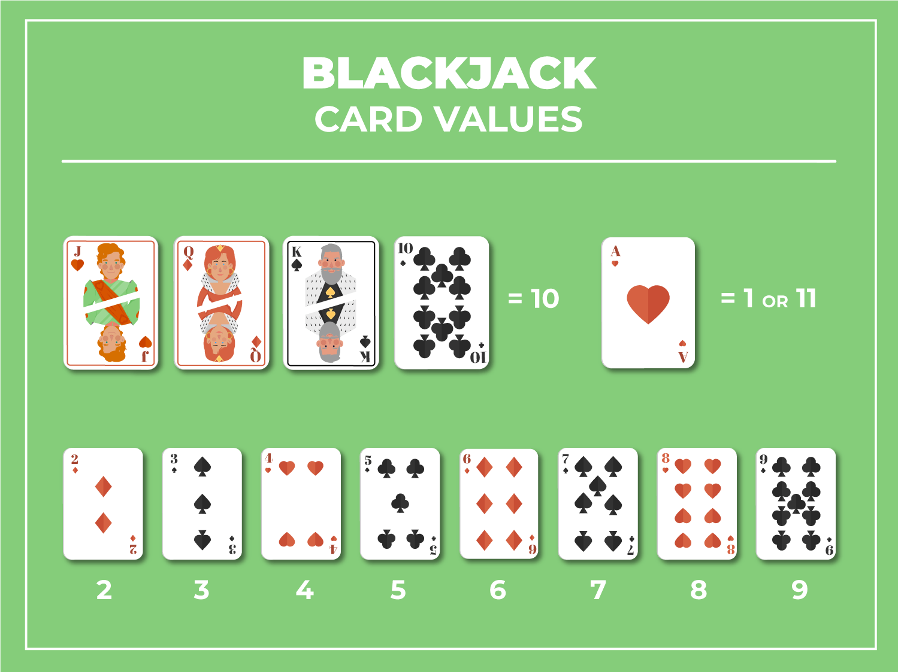
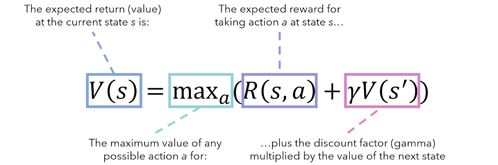
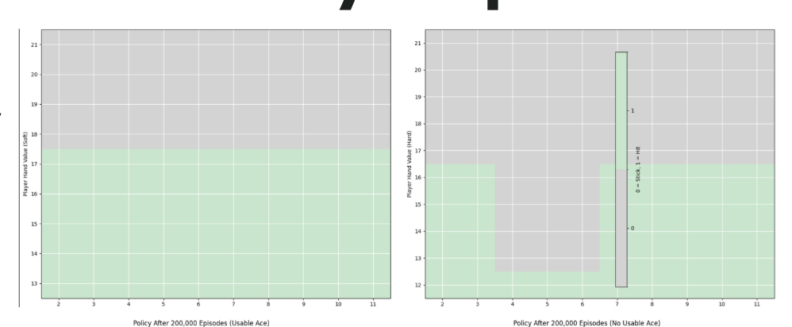
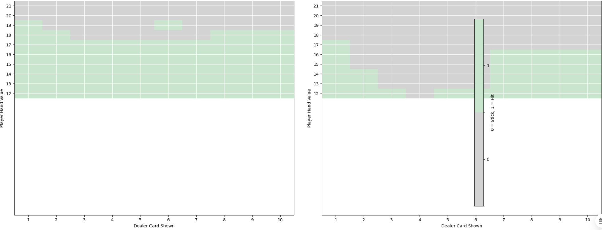

# Background

The most famous casino game Blackjack has one of the lowest house edges of any casino game, making it very attractive to players. I wanted to test the Q-learning algorithm to train a reinforcement learning model to learn the best possible move to make given a player’s hand and a dealer’s hand. Through probability theory and millions of stimulations, a basic Black strategy has been computed for every possible hand. As my benchmark, I compare my Q-learning policy with this strategy (also labeled Basic Blackjack Strategy).

# Environment
OpenAI’s blackjack stimulator is played using an infinite deck, meaning that as cards are withdrawn, they are reaplaced. This eliminates the possibiity of card counting, a strategy used to estimate if the next hand is more liekly to give the player or the dealer an advantage. The reward for winning is +1, the reward for losing is -1, and the reward for a draw is 0. A natural blackjack win is when a player’s first two cards are an ace and a ten-card, in which they gain a reward of +1.5.

# Algorithm 
Action Set: There are 32 possible player hand combinations, 11 possible dealer values, and an usuable vs usable aces. Thus, there are 32 x 11 x 2 total states possible. 
The objective is to define a policy function Q(s,a) such that for any possible state, we pick an action (a) that  maximizes future rewards.

When the agent takes an action 𝑎 (hit or stand) in a given state s ( current hand and dealer’s card), they receive an immediate reward r (e.g., winning, losing, or continuing the game). To make the best move, the agent estimates the total expected return by combining this immediate reward with the expected future reward by considering the maximum Q-value over all possible actions from the next state. This is best represented through the Bellaman equation to iteratively improve the Q-vales for each action-state. 

# Hyperparameter Tuning
 Epsilon Greedy ε: At each state, I decide what action to take (hit or stand). I compare my Q values for both actions. Usually, we take the action with the greatest Q value. However, in the first few iterations, it can be more beneficial to explore as Q-values  So to encourage my agent to explore options, ε value is used.
Higher ε: exploration is encouraged. Lower ε: exploitation is encouraged.

*Changing ε: As training progresses, I decided to decay my epsilon greedy to a lower bound of 0.15. This decay occurs at a rate of 1% per iteration, which means that as the algorithm gains more confidence in its Q-values through training, I shift from exploration to exploitation. By the time epsilon greedy reaches the lower bound, the algorithm is primarily exploiting the best-known actions rather than exploring new ones.

Learning Rate α is set to 0.01. I wanted to converge to the best policy function gradually even if it required more training. 

Discount Factor γ (0.15) A smaller discount factor  will have less significance when updating an action-state’s Q-value.

# Results

After around 20,000 training iterations, my model reached convergence to the basic strategy. 
By 1,000,000 training iterations, the Q-learning policy and the basic strategy began to score quite similarly, with a slightly negative expected reward of approximately -0.05 (negative values takes into account the guaranteed house edge). Overall, the action-state pairs in both strategies are almost identical, which means the agent’s policy function effectively reflects the optimal move. 

# Basic Strategy

# Q-Learned Strategy

