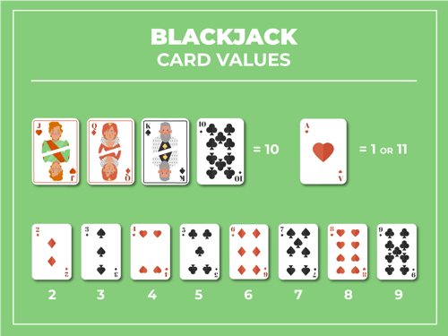
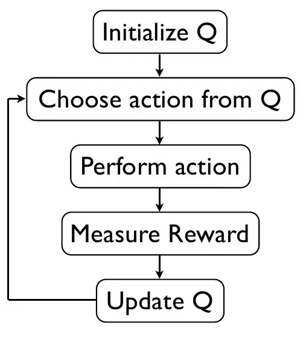

This is my reinforcement learning (RL) project -- an agent that learns to play blackjack with the most optimal strategy. The OpenAI Gym environment was used for gameplay stimulation. 

# Blackjack Agent
This is my reinforcement learning (RL) project -- an agent that learns to play blackjack with the most optimal strategy. The OpenAI Gym environment was used for gameplay stimulation.

#Background
The most famous casino game Blackjack has one of the lowest house edges of any casino game, making it very attractive to players. I wanted to test the Q-learning algorithm to train a reinforcement learning model to learn the best possible move to make given a player’s hand and a dealer’s hand.
)

#Method
I implemented a Q-learning algorithm to determine an optimal policy for playing Blackjack. Through probability theory and millions of stimulations, a basic Black strategy has been computed for every possible hand. As my benchmark, I compared my Q-learning policy with this strategy (also labeled Basic Blackjack Strategy).

#Environment
OpenAI’s blackjack game is played using an infinite deck, meaning that as cards are withdrawn, they are reaplaced. This eliminates the possibiit of card-counting which gives the player an unfair advantage. The reward for winning is +1, the reward for losing is -1, and the reward for a draw is 0. A natural blackjack win is when a player’s first two cards are an ace and a ten-card in which they gain a reward of +1.5.

#Algorithm 
Action Set: There are 32 possible player hand combinations, 11 possible dealer values, and an usuable vs usable aces. Thus, there are 32 x 11 x 2 total states possible. 
The objective is to define a policy function Q(s,a) such that for any possible state, we pick an action (a) that  maximizes future rewards.

Using the Bellman equation we can compute: If I take action a from state s, I get some immediate reward r, and potentially some future reward — which I estimate by looking at the best move I could make in the next game state.

[insert image

#Hyperparameter Tuning
 Epsilon Greedy ε: At each state, I decide what action to take (hit or stand). I compare my Q values for both actions. Usually, we take the action with the greatest Q value. However, in the first few iterations, it can be more beneficial to explore as Q-values  So to encourage my agent to explore options, ε value is used. Higher ε: exploration is encouraged. Lower ε: exploitation is encouraged.

 *Changing ε: As training progresses, I decided to decay my epsilon greedy to a lower bound of 0.15. This decay occurs at a rate of 1% per iteration, which means that as the algorithm gains more confidence in its Q-values through training iterations, I shift from exploration to exploitation. By the time the epsilon reaches the lower bound, the algorithm is primarily exploiting the best-known actions rather than exploring new ones

 Learning Rate α was set to 0.01. I wanted to coverage to the best function gradually even if it required more training. 

Discount Factor γ (0.15) A smaller discount factor  will have less significance when updating an action-state’s Q-value.

[insert Bellman equation image]

#Results

After around 20,000 training iterations, my model reached convergence to the basic strategy 
By 1,000,000 training iterations, the Q-learning policy and the basic strategy began to score quite similarly, with a slightly negative expected reward of approximately -0.05 (negative due to the guaranteed house edge).

Overall, the action-state pair
s in both strategies are almost identical, which means the agent’s policy function effectively reflects the optimal move. 

[insert basic strategy policy map]

[insert q srategy policy map]

